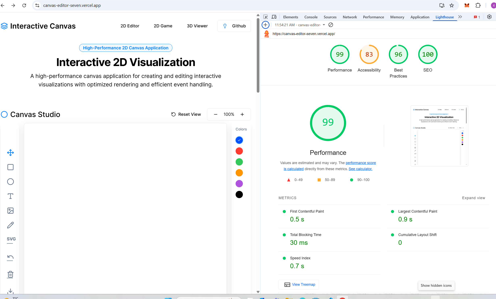
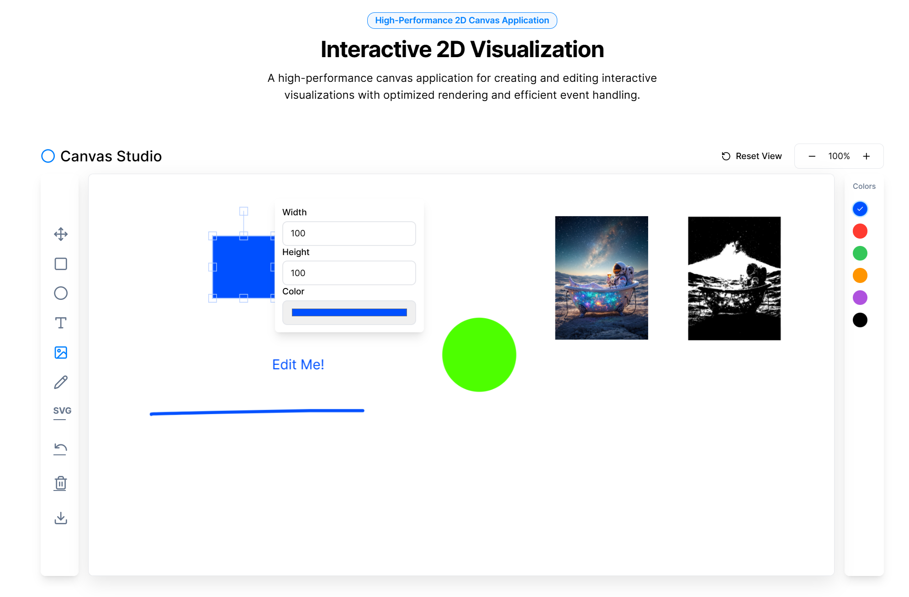
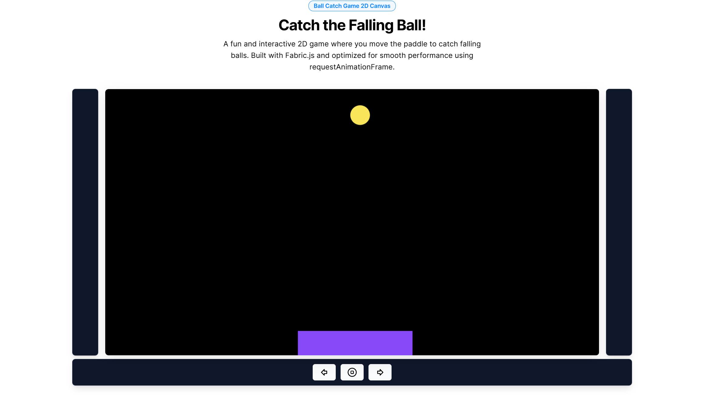
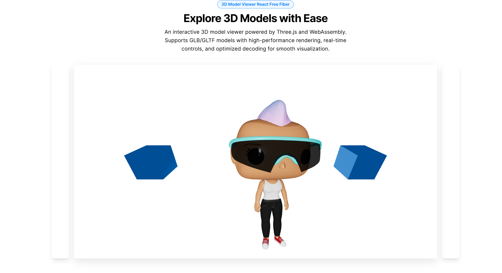

# 2D Editor 2D Game 3D Viewer

## Demo Deployed in vercel

[Demo](https://canvas-editor-seven.vercel.app/)

## Installation

```bash
git clone https://github.com/AmramAnanyan/square_signs.git
npm install
npm start
http://localhost:3000
```

## Project Structure

```plaintext
/src
 ├── app/
 ├── ColorPicker/
 │    ├── 3DModel/
 │    └── ...
 ├── entities/
 │    ├── 3DModel/
 │    └── ...
 ├── features/
 │    ├── PlayGame/
 │
 │    └── ...
 ├── utils/
 │    ├── canvasHelper/
 │    ├── hooks/
 │    └── ...
 ├── pages/
 ├── index.tsx
 └── README.md
```

## Project Optimization

### Attention: In development mode, React's Strict Mode is enabled, which causes components to re-render twice to help identify potential side effects. As a result, cleanup functions will also run twice, which is normal behavior for development but should be taken into account during development.

### 1. **Modular Code Structure**

- Files are kept under 200 lines of code to maintain clarity and prevent complexity. This modular approach helps with scalability and easier debugging.

### 2. **React Optimization**

- **`useCallback`**: Used to prevent unnecessary re-renders when passing functions as props, improving performance.
- **Lazy Loading**: Large, independent components (e.g., 3D viewer) are loaded lazily to reduce initial bundle size, avoiding the overhead of one large file.

### 3. **Animation Optimization**

- **`requestAnimationFrame`**: For smooth animations like the falling ball, `requestAnimationFrame` is used to ensure efficient rendering and avoid jank, which is common with `setTimeout` or `setInterval`.

### 4. **Event Listener Cleanup**

- All event listeners are properly removed in the cleanup function to prevent memory leaks and ensure efficient use of resources when components unmount.

### 5. **WebAssembly for 3D Models**

- **Draco Compression**: WebAssembly is used alongside Draco to optimize the loading of 3D GLB models by reducing their file sizes, resulting in faster load times and better performance.
- The app is split into multiple smaller chunks instead of one large chunk to optimize loading time and improve caching.

### 6. **TypeScript Optimizations**

- **`const enum`** is used instead of regular `enum` to avoid redundant JavaScript code during the build process, reducing output size and improving build times.

### 7. **Best Practices**

- React and browser performance best practices are followed, including minimizing re-renders, optimizing DOM manipulation, and managing component lifecycle efficiently.

### 8. **Performance Testing**

- The project is tested using **Lighthouse** to ensure high performance, accessibility,SEO,First Contentful Paint,Largest Contentful Paint ...etc, and compliance with best practices.

### 9. **Development**

- Vercel automatically gziped files, and react optimized with webpack like tree shaking









## Resources & Documentation

- [React Docs](https://react.dev/)
- [Draco](https://github.com/google/draco)
- [Feature-Sliced Design](https://feature-sliced.design/)
- [TypeScript Docs](https://www.typescriptlang.org/)
- [Fabric](https://fabricjs.com/)
  [React Free Fiber](https://r3f.docs.pmnd.rs/getting-started/introduction)
